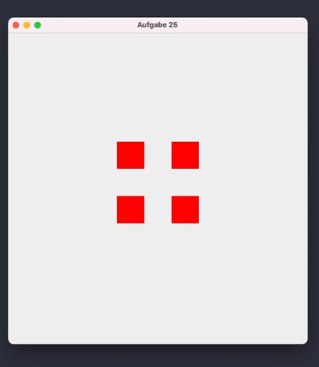

# Aufgabe 25
Erstellen Sie das dargestellte Fenster in der Größe 550x600 Pixel. Die Panel (50x50)
sollen sich alle 250ms schrittweise schräg um 5 Pixel auseinander bewegen.
Was passiert mit den Panels? Wie können Sie das ändern?

Hinweis: Sie müssen dem Konstruktor des JFrame die Anweisung `setLayout(null);` hinzufügen.

