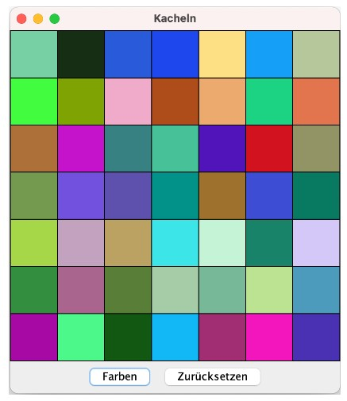

# Übungsblatt 12
## Aufgabe 1
In einem Fenster sollen 7x7 weiße Kacheln angezeigt werden, wie unten dargestellt. Wird
der Button Farben gedrückt, so sollen alle Kacheln mit einer zufälligen Farbe gefüllt werden. Wird nur ein einzelnes Panel angeklickt, so wird die Farbe für dieses Panel zufällig
gesetzt. Ein Klick auf Zurücksetzen setzt alle Kacheln wieder auf Weiß.

*Hinweis: Schauen Sie sich die Konstruktoren der Klasse Color an.*

