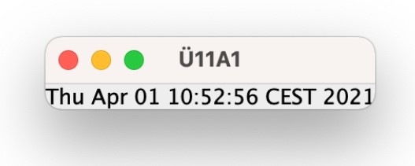
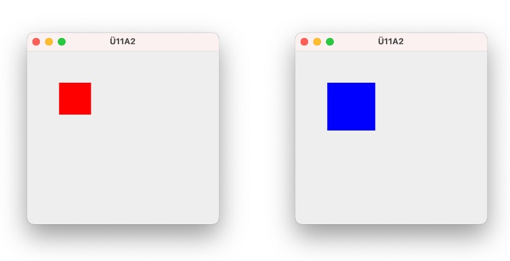

# Übungsblatt 11
## Aufgabe 1
Implementieren Sie die in der folgenden Abbildung dargestellten Java-Anwendung. Diese
soll per Timer gesteuert in einem `JLabel` die aktuelle Uhrzeit anzeigen.

## Aufgabe 2
Erstellen Sie eine Java-Anwendung, wie in der folgenden Abbildung dargestellt. Das rote
Panel soll sich vergrößern und die Farbe auf blau ändern, sobald der Benutzer die Maus
in das Panel bewegt. Wenn die Maus das Panel wieder verlässt, dann soll die ursprünglich
Größe und Farbe wiederhergestellt werden.

